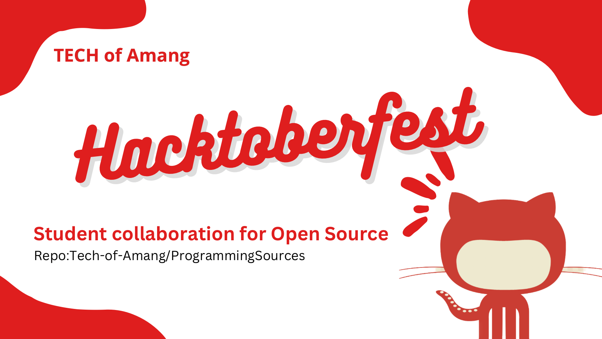

# ProgrammingSources

<!-- image tag for thumbnail -->


A collection of basic programs from various different programming languages.

- You can contribute programs from any languages

## Contributing Guidelines

1.  Make a folder of the language you are writing program on if it doesn't exist already

    Example:

    ```
    JavaScript -> program.js
    Python -> program.py
    Rust -> program.rs
    PHP -> program.php
    HTML -> index.html
    
    Note: Put your project in one folder before commiting changes
    ```

2.  Pre-Existing programs can be refactored and made a pull request but if a program already exists in the repo, donot make another pull request for the same program.
3.  No spam pull requests, any spam pull requests will be marked as `Spam`


### That's it. Happy Contributing!

<h1 align="center">Project Maintainers ⛑️</h1>

<div align="center">

| John Moren Dinela                                                    | John Allen Florencio                                              | Lee Angelo Mollo                                                |                                             |                                                     |
| ------------------------------------------------------------------ | -------------------------------------------------------- | -------------------------------------------------------------- | ------------------------------------------------------------ | ------------------------------------------------------------------ |
|  |  |  |  |  |

</div>
